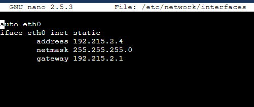
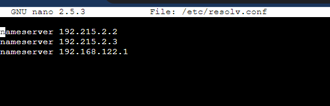
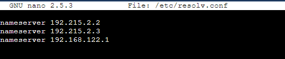
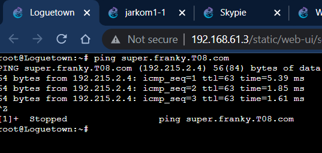
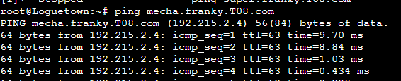
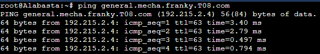
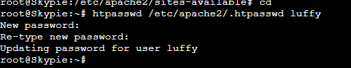
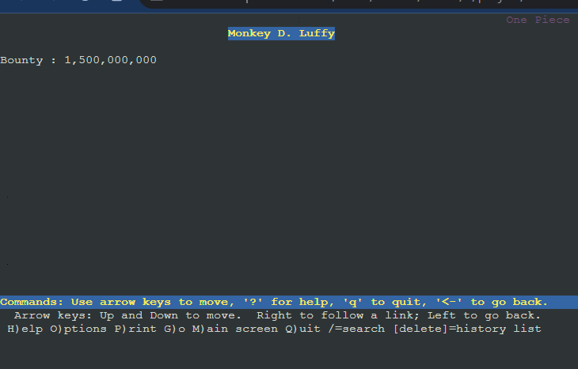
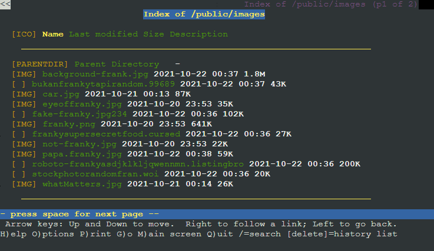

# Jarkom-Modul-2-T08-2021

Laporan Resmi Praktikum Jarkom Modul 2

Disusun oleh :
* Clarissa Fatimah (05311940000012)
* Alessandro Tionardo (05311940000018)
* Christoper Adrian Kusuma (05311940000022)

---

## Nomer 1 
### EniesLobby akan dijadikan sebagai DNS Master.
1. masukkan perintah pada enieslobby    
    ```
    nano /etc/bind/named.conf.local
    ```
2. mengisi konfigurasi 
    ```zone "franky.T08.com" {
	    type master;
	    file "/etc/bind/kaizoku/franky.T08.com";
        };
    ```
 ### Water7 akan dijadikan DNS Slave, 

 1. pertama-tama lakukan konfigurasi pada enieslobby dengan mengedit file `/etc/bind/named.conf.local` dan sesuaikan dengan syntax berikut
    ```
    zone "franky.T08.com" {
    type master;
    notify yes;
    also-notify { 192.215.2.3; };
    allow-transfer { 192.215.2.3; };
    file "/etc/bind/kaizoku/franky.T08.com";
    };
    ```
2. ketikkan perintah `service bind9 restart`
3. lalu lakukan konfigurasi Pada Server Water7 dengan mengetikkan `apt-get update`
4. setalah melakukan update silahkan install aplikasi bind9 pada Water7 dengan perintah `apt-get install bind9 -y`
5. kemudian buka file /etc/bind/named.conf.local pada Water7 dan tambahkan syntax berikut 
    ```
    zone "franky.T08.com" {
        type slave;
        masters { 192.215.2.2; }; 
        file "/var/lib/bind/franky.T08.com";
    };
    ```
6. masukkan perintah `service bind9 restart`
 
 ### dan Skypie akan digunakan sebagai Web Server. 
  

 ### Terdapat 2 Client yaitu Loguetown, dan Alabasta. 
 Semua node terhubung pada router Foosha, sehingga dapat mengakses internet.
 - pada alabasta
   
- pada loguetown
    
keduanya memiliki name server  yang sama yakni mengarah pada enilobby dan water7

## Nomer 2
### membuat website dengan mengakses franky.T08.com dengan alias www.franky.T08.com pada folder kaizoku
1. masukkan perintah `nano /etc/bind/named.conf.local`
2. disesuaikan sebagai berikut :
    ```
    zone "franky.T08.com" {
    type master;
    file "/etc/bind/jarkom/franky.T08.com";
    };
    zone "super.franky.T08.com" {
    type master;
    file "/etc/bind/kaizoku/super.franky.T08.com";
    };
    ```
3. membuat folder `mkdir /etc/bind/kaizoku`
4. Copykan file `cp /etc/bind/db.local /etc/bind/kaizoku/franky.T08.com`
5. cd kaizoku
6. masukkan perintah di folder baru `nano /etc/bind/kaizoku/franky.T08.com`
7. disesuaikan sebagai berikut :
    ```
    @       IN      SOA     franky.T08.com. root.franky.T08.com. (
                      2021100401          ; Serial
                         604800         ; Refresh
                          86400         ; Retry
                        2419200         ; Expire
                         604800 )       ; Negative Cache TTL;
    @       IN      NS      franky.T08.com.
    @       IN      A       192.168.2.2 ;IP EniesLobby
    www     IN      CNAME   franky.T08.com.

    ```
## Nomer 3
### Setelah itu buat subdomain super.franky.T08.com dengan alias www.super.franky.T08.com yang diatur DNS nya di EniesLobby dan mengarah ke Skypie
1. pada enieslobby ketikkan perintah `nano /etc/bind/kaizoku/franky.T08.com`
2. Tambahkan konfigurasi 
    ```
    @       IN      SOA     franky.T08.com. root.franky.T08.com. (
                          2021100401         ; Serial
                         604800         ; Refresh
                          86400         ; Retry
                        2419200         ; Expire
                         604800 )       ; Negative Cache TTL
    ;
    @       IN      NS      franky.T08.com.
    @       IN      A       192.168.2.2 ;IP EniesLobby
    www     IN      CNAME   franky.T08.com.
    super   IN      A       192.168.2.4 ;IP Skypie
    ```
3. ketikkan `service bind9 restart`
4. ketika dicoba ping ke loguetown


## Nomer 4
### Buat juga reverse domain untuk domain utama 
1. pada enieslobby, masukkan perintah `nano /etc/bind/named.conf.local`
2.  konfigurasi seperti ini
    ```
    zone "2.168.192.in-addr.arpa" {
        type master;
        file "/etc/bind/kaizoku/2.168.192.in-addr.arpa";
    };

    ```
3. copykan sebagai berikut `cp /etc/bind/db.local /etc/bind/kaizoku/2.168.192.in-addr.arpa`
4. masukkan perintah `nano /etc/bind/kaizoku/2.168.192.in-addr.arpa`
5. konfigurasikan pada folder kaizoku
    ```
    @       IN      SOA     franky.T08.com. root.franky.T08.com. (
                            2021100401         ; Serial
                            604800         ; Refresh
                            86400         ; Retry
                            2419200         ; Expire
                            604800 )       ; Negative Cache TTL;
    2.168.192.in-addr.arpa  IN      NS      franky.T08.com.
    2       IN      PTR     franky.T08.com.

    ```
## Nomer 5
### Supaya tetap bisa menghubungi Franky jika server EniesLobby rusak, maka buat Water7 sebagai DNS Slave untuk domain utama 
1. pada enieslobby, masukkan perintah `nano /etc/bind/named.conf.local`
2. konfigurasikan sebagai berikut
    ```
    zone "franky.T08.com" {
            type master;
            notify yes;
            also-notify { 192.168.2.3; }; //IP Water7
            allow-transfer { 192.168.2.3; }; //IP Water7
            file "/etc/bind/kaizoku/franky.T08.com";
    };
    ```
3. masukkan perintah `service bind9 restart`
4. selanjutnya, pada water7 lakukan `apt-get update`, kemudian `apt-get install bind9 -y`, jika sudah maka masukkan perintah `nano /etc/bind/named.conf.local`
    ```
    zone "franky.T08.com" {
        type slave;
        masters { 192.168.2.2; }; // Masukan IP EniesLobby tanpa tanda petik
        file "/var/lib/bind/franky.T08.com";
    };
    ```
## Nomer 6
Setelah itu terdapat subdomain mecha.franky.yyy.com dengan alias www.mecha.franky.yyy.com yang didelegasikan dari EniesLobby ke Water7 dengan IP menuju ke Skypie dalam folder sunnygo.
1. pada enieslobby ketikkan perintah `nano /etc/bind/kaizoku/franky.T08.com`
2. konfigurasikan sebagai berikut
    ```
    ;
    ; BIND data file for local loopback interface
    ;
    $TTL    604800
    @       IN      SOA     franky.T08.com. root.franky.T08.com. (
                        2021100401         ; Serial
                            604800         ; Refresh
                            86400         ; Retry
                            2419200         ; Expire
                            604800 )       ; Negative Cache TTL
    ;
    @               IN      NS      franky.T08.com.
    @               IN      A       192.215.2.4
    www             IN      CNAME   franky.T08.com.
    super           IN      A       192.215.2.4
    www.super       IN      CNAME   super.franky.T08.com.
    ns1             IN      A       192.215.2.3 //menuju water7
    mecha           IN      NS      ns1
    ```
3. ketikkan `service bind9 restart`
4. pada water7, buat folder sunnygo dengan perintah membuat folder `mkdir /etc/bind/sunnygo`. dimana nantinya akan dikonfigurasikan dengan ip skypie.
5. masukkan perintah `nano mecha.franky.T08.com`
6. konfigurasikan sebagai berikut
    ```
    ;
    ; BIND data file for local loopback interface
    ;
    $TTL    604800
    @       IN      SOA     mecha.franky.T08.com. root.mecha.franky.T08.com. (
                        2021100401         ; Serial
                            604800         ; Refresh
                            86400         ; Retry
                            2419200         ; Expire
                            604800 )       ; Negative Cache TTL
    ;
    @               IN      NS      mecha.franky.T08.com.
    @               IN      A       192.215.2.4 //ip skypie
    www             IN      CNAME   mecha.franky.T08.com.

    ```
7. ketika dicoba ping ke loguetown `ping mecha.franky.T08.com`


## Nomer 7
### Untuk memperlancar komunikasi Luffy dan rekannya, dibuatkan subdomain melalui Water7 dengan nama general.mecha.franky.yyy.com dengan alias www.general.mecha.franky.yyy.com yang mengarah ke Skypie
1. pada water7, ketikkan perintah `nano /etc/bind/sunnygo/mecha.franky.T08.com`
2. konfigurasikan sebagai berikut, dimana ip mengarah ke skypie
    ```
        ;
    ; BIND data file for local loopback interface
    ;
    $TTL    604800
    @       IN      SOA     mecha.franky.T08.com. root.mecha.franky.T08.com. (
                        2021100401         ; Serial
                            604800         ; Refresh
                            86400         ; Retry
                            2419200         ; Expire
                            604800 )       ; Negative Cache TTL
    ;
    @               IN      NS      mecha.franky.T08.com.
    @               IN      A       192.215.2.4
    www             IN      CNAME   mecha.franky.T08.com.
    general         IN      A       192.215.2.4 //ip skypie
    www.general     IN      CNAME   general.mecha.franky.T08.com.

    ```
3. ketikkan `service bind9 restart`
4. ketika dicoba ping ke alabasta `ping general.mecha.franky.T08.com `



## 8. Setelah melakukan konfigurasi server, maka dilakukan konfigurasi Webserver. Pertama dengan webserver `www.franky.yyy.com`. Pertama, luffy membutuhkan webserver dengan DocumentRoot pada `/var/www/franky.yyy.com`.

### Solusi
Pertama-tama install php dan apache pada *Skypie*.

```
apt-get install php
apt-get install apache2
```
Lalu jalankan webserver Apache
```
service apache2 start
```
Lalu melakukan gitclone `https://github.com/FeinardSlim/Praktikum-Modul-2-Jarkom` pada /var/www, selanjutnya melakukan unzip dan rename folder sesuai dengan syarat soal shift.


Selanjutnya mengcopy file dari `/etc/apache2/sites-available/000-default.conf` menjadi `/etc/apache2/sites-available/franky.T08.com.conf`. Lalu mengatur konfigurasi webserver dengan DocumentRoot pada /var/www/franky.T08.com.


Lalu mencoba membuka `franky.T08.com` dengan lynx pada *Loguetown*.


## 9. Setelah itu, Luffy juga membutuhkan agar url `www.franky.yyy.com/index.php/home` dapat menjadi menjadi `www.franky.yyy.com/home`. 


### Solusi
Menggunakan module *rewrite*. Pertama aktifkan module dengan `a2enmod rewrite`, selanjutnya pindah ke `/var/www/franky.T08.com/` lalu membuat file `.htaccess` dengan isi : 
```
 RewriteEngine On
 RewriteCond %{REQUEST_FILENAME} !-d
 RewriteRule ^([^\.]+)$ $1.php [NC,L]
```


Pindah ke directory /etc/apache2/sites-available kemudian buka file franky.TO8.com.conf dan tambahkan.

```
 <Directory /var/www/franky.T08.com>
     Options +FollowSymLinks -Multiviews
     AllowOverride All
 </Directory>
```


Selanjutnya mencoba membuka `www.franky.T08.com/home` dengan lynx pada *Loguetown*.


## 10. Setelah itu, pada subdomain `www.super.franky.yyy.com`, Luffy membutuhkan penyimpanan aset yang memiliki DocumentRoot pada `/var/www/super.franky.yyy.com`.

### Solusi

Selanjutnya mengcopy file dari `/etc/apache2/sites-available/000-default.conf` menjadi `/etc/apache2/sites-available/super.franky.T08.com.conf`. Lalu mengatur konfigurasi webserver dengan DocumentRoot pada /var/www/super.franky.T08.com dengan menambahkan :

```
 <Directory /var/www/super.franky.T08.com>
     Options +Indexes
 </Directory>
```


Selanjutnya mencoba membuka `super.www.franky.T08.com` dengan lynx pada *Loguetown*.


## 11. Akan tetapi, pada folder /public, Luffy ingin hanya dapat melakukan directory listing saja.


### Solusi
Pertama-tama mengatur konfigurasi webserver dengan DocumentRoot pada `/var/www/super.franky.T08.com` dengan menambahkan :

```
 <Directory /var/www/super.franky.T08.com>
     Options +Indexes
 </Directory>
```


Selanjutnya mencoba membuka `super.www.franky.T08.com` dengan lynx pada *Loguetown*.


## 12. Tidak hanya itu, Luffy juga menyiapkan error file 404.html pada folder /error untuk mengganti error kode pada apache .

### Solusi
Untuk mengganti, pindah ke `/var/www/super.www.franky.T08.com` lalu membuat .htaccess


Selanjutnya mencoba membuka `super.www.franky.T08.com` dengan lynx pada *Loguetown*.


## Nomer 13
### Luffy juga meminta Nami untuk dibuatkan konfigurasi virtual host. Virtual host ini bertujuan untuk dapat mengakses file asset www.super.franky.yyy.com/public/js menjadi www.super.franky.yyy.com/js.
1. Pindah ke directory `/etc/apache2/sites-available` kemudian buka file    `nano franky.T08.com.conf` dan tambahkan
    ```
    <VirtualHost *:80>
            ServerName super.franky.T08.com
            ServerAlias www.super.franky.T08.com
            ServerAdmin webmaster@localhost
            DocumentRoot /var/www/super.franky.T08.com

            <Directory /var/www/super.franky.T08.com>
                    Options +Indexes +FollowSymLinks -MultiViews
                    AllowOverride All
            </Directory>

            Alias "/js" "/var/www/super.franky.T08.com/public/js"

            ErrorLog ${APACHE_LOG_DIR}/error.log
            CustomLog ${APACHE_LOG_DIR}/access.log combined
    </VirtualHost>
    # vim: syntax=apache ts=4 sw=4 sts=4 sr noet`
    ```
2. Restart apache dengan perintah `service apache2 restart`
3. Pindah ke folder `/var/www/super.franky.T08.com/public/js` 

## Nomer 14
### Dan Luffy meminta untuk web www.general.mecha.franky.yyy.com hanya bisa diakses dengan port 15000 dan port 15500
1. menuju direktori `cd /etc/apache2/sites-available`
2. copy menjadi `/etc/apache2/sites-available/www.general.mecha.franky.T08.com.conf`
3. Tag <VirtualHost> diedit agar memiliki port 15000 dan 15500. Lalu disetting agar memiliki line ServerName general.mecha.franky.T08.com, DocumentRoot /var/www/general.mecha.franky.T08.com, dan tag <Directory> mengarah ke /var/www/general.mecha.franky.T08.com.
seperti ini :
    ```
    <VirtualHost *:15000>
            ServerName general.mecha.franky.T08.com
            ServerAlias www.general.mecha.franky.T08.com
            ServerAdmin webmaster@localhost
            DocumentRoot /var/www/general.mecha.franky.T08

            <Directory "/var/www/general.mecha.franky.T08">
                    AllowOverride All
            </Directory>

            ErrorLog ${APACHE_LOG_DIR}/error.log
            CustomLog ${APACHE_LOG_DIR}/access.log combined
    </VirtualHost>

    <VirtualHost *:15500>
            ServerName general.mecha.franky.T08.com
            ServerAlias www.general.mecha.franky.T08.com
            ServerAdmin webmaster@localhost
            DocumentRoot /var/www/general.mecha.franky.T08
    ```

## Nomer 15
### dengan autentikasi username luffy dan password onepiece dan file di /var/www/general.mecha.franky.yyy
1. Pertama, jalankan command `htpasswd /etc/apache2/.htpasswd luffy` untuk membuat file yang menyimpan username dan password kedalam file `/etc/apache2/.htpasswd` dengan user luffy, lalu akan ada prompt untuk memasukkan passwordnya.

2. Pada file virtual host /etc/apache2/sites-available/general.mecha.franky.T08.com.conf, tag <Directory> yang mengarah ke /var/www/general.mecha.franky.T08 diedit agar memiliki line AllowOverride All.
    ```
    <Directory "/var/www/general.mecha.franky.T08">
                    AllowOverride All
            </Directory>
    ```
3. Lalu kita edit file /var/www/general.mecha.franky.T08/.htaccess agar memiliki autentikasi basic dan memiliki konfigurasi username dan password sesuai dengan /etc/apache2/.htpasswd.
    ```
    AuthType Basic
    AuthName "Restricted Content"
    AuthUserFile /etc/apache2/.htpasswd
    Require valid-user
    ```

## Nomer 16
### Dan setiap kali mengakses IP Skypie akan dialihkan secara otomatis ke www.franky.yyy.com
1. Pada `/etc/apache2/sites-available/000-default.conf`, ditambahkan line Redirect 301 / www.franky.T08.com agar setiap kali ada yang mengakses IP Skypie akan langsung diredirect ke halaman site www.franky.T08.com
```

<VirtualHost *:80>
        ServerName T08.com
        ServerAdmin webmaster@localhost

        Redirect 301 / http://www.franky.T08.com

        ErrorLog ${APACHE_LOG_DIR}/error.log
        CustomLog ${APACHE_LOG_DIR}/access.log combined
</VirtualHost>

# vim: syntax=apache ts=4 sw=4 sts=4 sr noet
```



## Nomer 17
### Dikarenakan Franky juga ingin mengajak temannya untuk dapat menghubunginya melalui website www.super.franky.yyy.com, dan dikarenakan pengunjung web server pasti akan bingung dengan randomnya images yang ada, maka Franky juga meminta untuk mengganti request gambar yang memiliki substring “franky” akan diarahkan menuju franky.png. Maka bantulah Luffy untuk membuat konfigurasi dns dan web server ini!
1. Jalankan perintah `a2enmod rewrite` untuk mengaktifkan module rewrite.
2. Restart apache dengan perintah `service apache2 restart``
3. aktifkan bagian AllowOverride All pada konfigurasi virtual host `/etc/apache2/sites-available/super.franky.T08.com.conf`
    ```
    <Directory /var/www/super.franky.T08.com>
                    Options +Indexes +FollowSymLinks -MultiViews
                    AllowOverride All
            </Directory>
    ```
4. Lalu edit `/var/www/super.franky.T08.com` agar memiliki RewriteRule untuk mengarahkan semua akses yang memiliki substring "franky" menjadi menuju /public/images/franky.png.

5. untuk menampilkan rewrite engine dibutuhkan .htacess seperti pada gambar.


	    
## Kendala yang dialami
- Tidak ada

