# Jarkom-Modul-2-T08-2021


## 8. Setelah melakukan konfigurasi server, maka dilakukan konfigurasi Webserver. Pertama dengan webserver `www.franky.yyy.com`. Pertama, luffy membutuhkan webserver dengan DocumentRoot pada `/var/www/franky.yyy.com`.

### Solusi
Pertama-tama install php dan apache pada *Skypie*.

```
apt-get install php
apt-get install apache2
```
Lalu jalankan webserver Apache
```
service apache2 start
```
Lalu melakukan gitclone `https://github.com/FeinardSlim/Praktikum-Modul-2-Jarkom` pada /var/www, selanjutnya melakukan unzip dan rename folder sesuai dengan syarat soal shift.

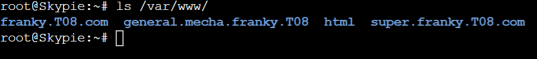

Selanjutnya mengcopy file dari `/etc/apache2/sites-available/000-default.conf` menjadi `/etc/apache2/sites-available/franky.T08.com.conf`. Lalu mengatur konfigurasi webserver dengan DocumentRoot pada /var/www/franky.T08.com.

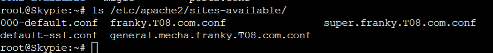
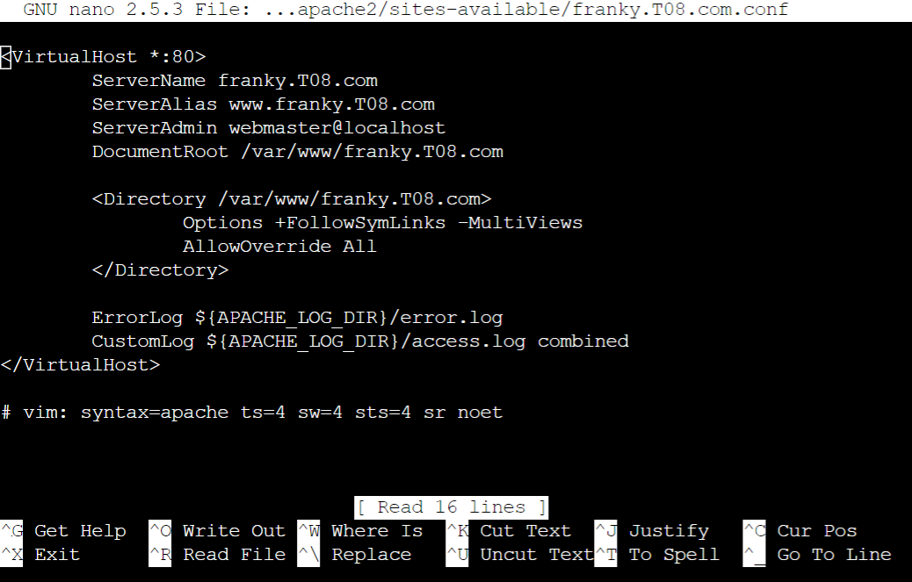

Lalu mencoba membuka `franky.T08.com` dengan lynx pada *Loguetown*.

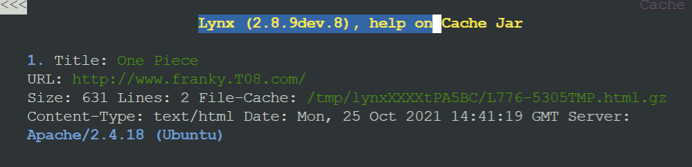
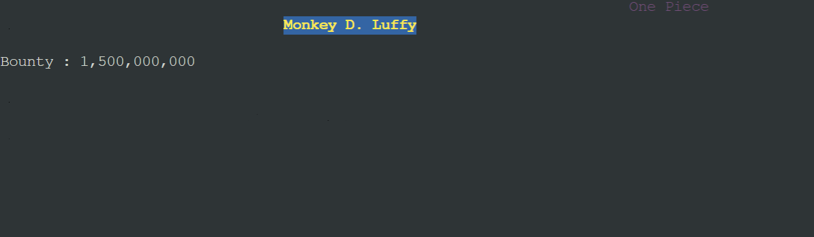


## 9. Setelah itu, Luffy juga membutuhkan agar url `www.franky.yyy.com/index.php/home` dapat menjadi menjadi `www.franky.yyy.com/home`. 


### Solusi
Menggunakan module *rewrite*. Pertama aktifkan module dengan `a2enmod rewrite`, selanjutnya pindah ke `/var/www/franky.T08.com/` lalu membuat file `.htaccess` dengan isi : 
```
 RewriteEngine On
 RewriteCond %{REQUEST_FILENAME} !-d
 RewriteRule ^([^\.]+)$ $1.php [NC,L]
```

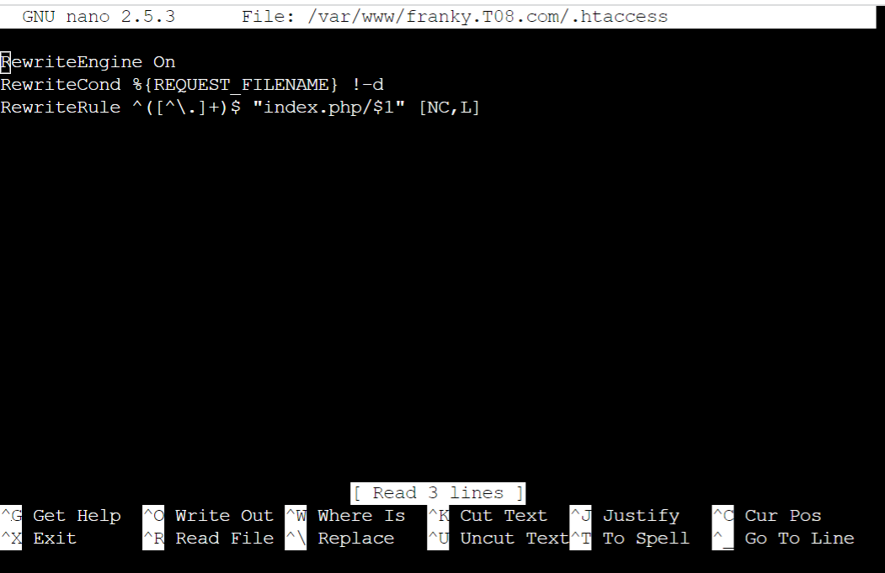

Pindah ke directory /etc/apache2/sites-available kemudian buka file franky.TO8.com.conf dan tambahkan.

```
 <Directory /var/www/franky.T08.com>
     Options +FollowSymLinks -Multiviews
     AllowOverride All
 </Directory>
```

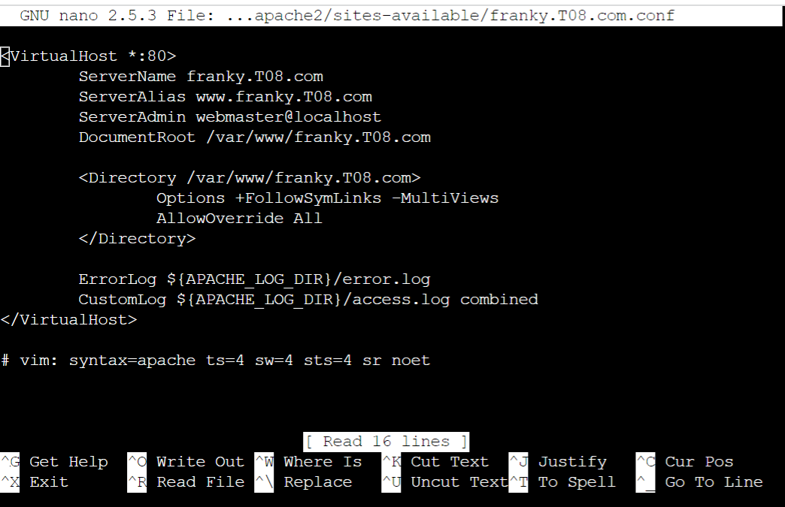

Selanjutnya mencoba membuka `www.franky.T08.com/home` dengan lynx pada *Loguetown*.

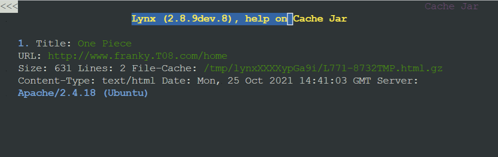


## 10. Setelah itu, pada subdomain `www.super.franky.yyy.com`, Luffy membutuhkan penyimpanan aset yang memiliki DocumentRoot pada `/var/www/super.franky.yyy.com`.

### Solusi

Selanjutnya mengcopy file dari `/etc/apache2/sites-available/000-default.conf` menjadi `/etc/apache2/sites-available/super.franky.T08.com.conf`. Lalu mengatur konfigurasi webserver dengan DocumentRoot pada /var/www/super.franky.T08.com dengan menambahkan :

```
 <Directory /var/www/super.franky.T08.com>
     Options +Indexes
 </Directory>
```

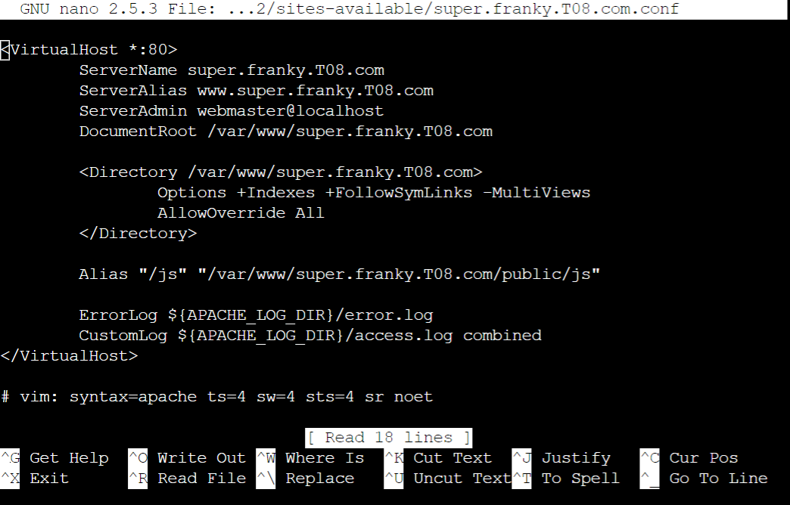

Selanjutnya mencoba membuka `super.www.franky.T08.com` dengan lynx pada *Loguetown*.

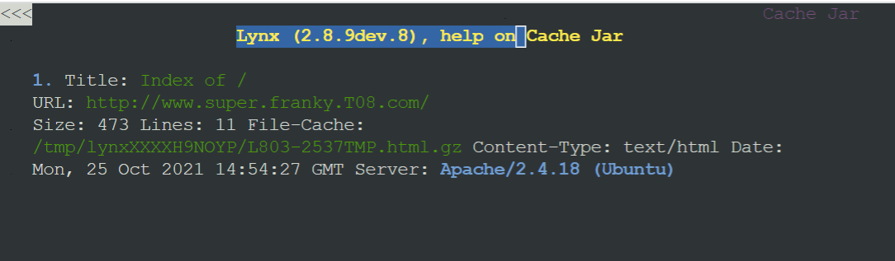
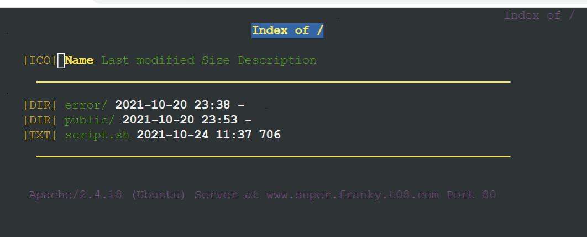


## 11. Akan tetapi, pada folder /public, Luffy ingin hanya dapat melakukan directory listing saja.


### Solusi
Pertama-tama mengatur konfigurasi webserver dengan DocumentRoot pada `/var/www/super.franky.T08.com` dengan menambahkan :

```
 <Directory /var/www/super.franky.T08.com>
     Options +Indexes
 </Directory>
```

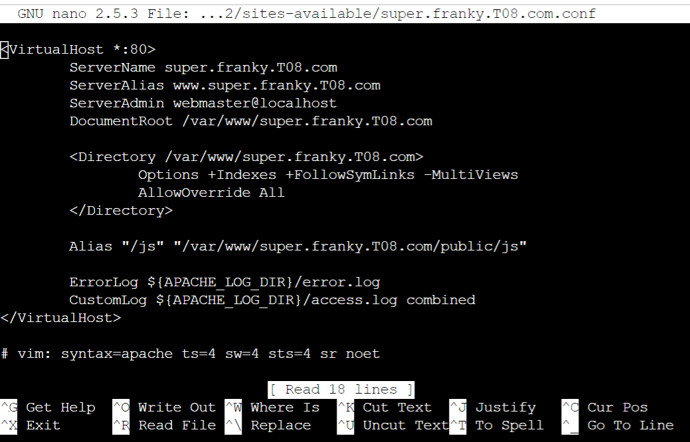

Selanjutnya mencoba membuka `super.www.franky.T08.com` dengan lynx pada *Loguetown*.

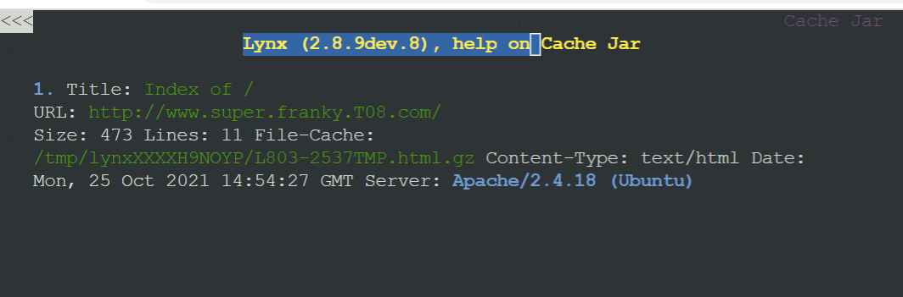
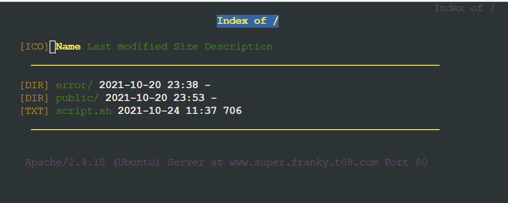
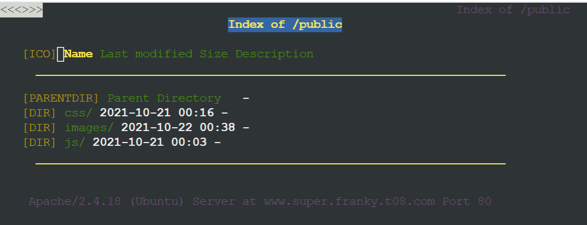

## 12. Tidak hanya itu, Luffy juga menyiapkan error file 404.html pada folder /error untuk mengganti error kode pada apache .

### Solusi
Untuk mengganti, pindah ke /var/www/super.www.franky.T08.com lalu membuat .htaccess

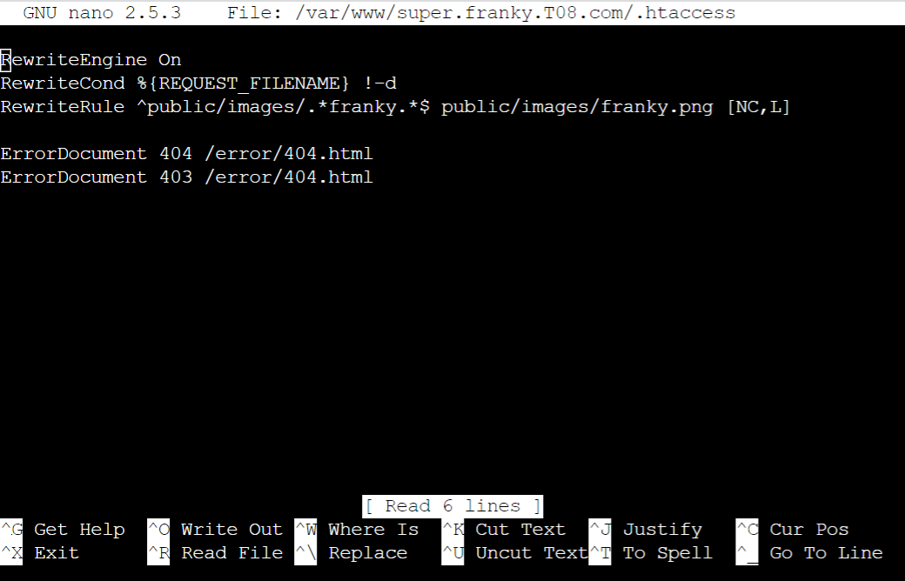

Selanjutnya mencoba membuka `super.www.franky.T08.com` dengan lynx pada *Loguetown*.

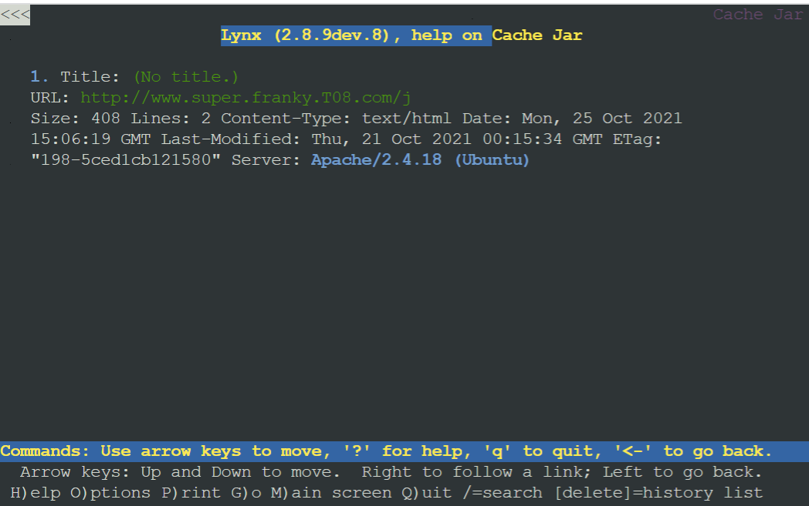
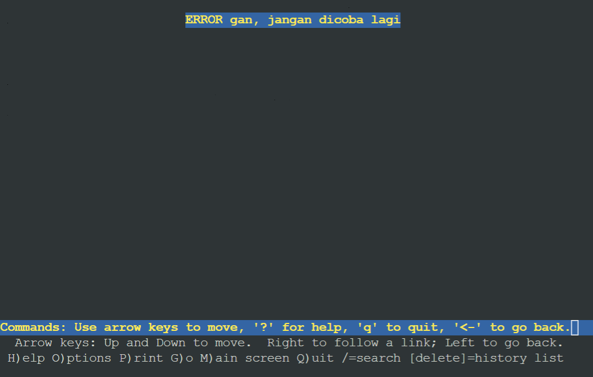

